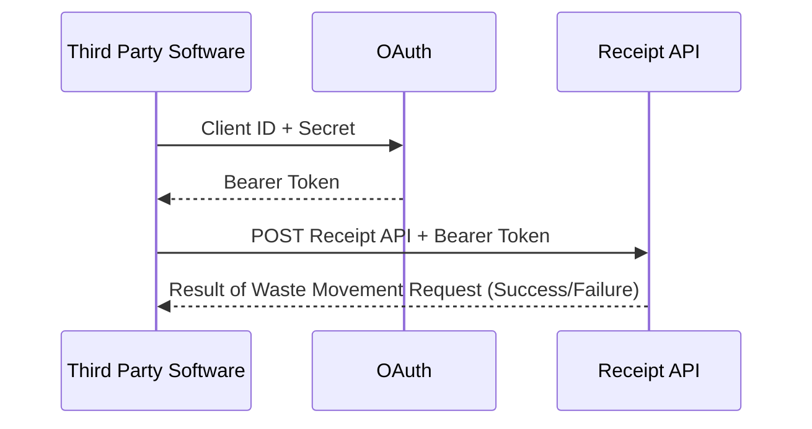

# Receipt of Waste - API authentication Note

To start using the Receipt API, you need your Client ID and Secret which you should have received via email. You will need this to apply to the OAuth service for an access/bearer token. The diagram below shows the authentication flow:

This process involves two steps: 

1. Submit the client id and secret to the OAuth service to be granted an access token. See the python code snippet below.

2. Submit the access/bearer token to use the API. See the python code snippet below.

##What are the login URLs for my API?

https://waste-movement-external-api-8ec5c.auth.eu-west-2.amazoncognito.com/oauth2/token

 Page last updated on 23 September 2025.
