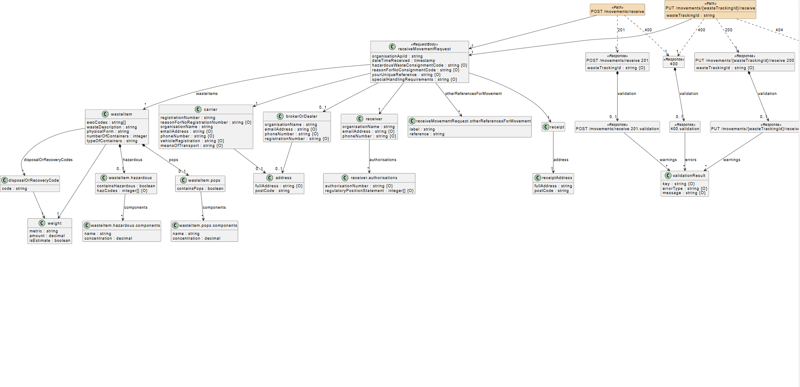

# Receipt of Waste - draft API specification

!!! Note "Private Beta"
    Are you a waste receiver or software provider and want to get involved? [Sign up for our Digital Waste Tracking Private Beta test](private-beta-comms-sign-up.md)

> These APIs are a draft. They may be updated to reflect changes to policy, legislation and user feedback.

We are designing waste tracking APIs to be flexible and accommodate differences in business processes, allowing for:

- separate submission of waste collection and receipt data, whilst maintaining a connection between the two
- differences in data requirements
- data to be submitted in any order (e.g. receipt before collection)

##Draft Open API specifications
The following draft specifications are all published on the Swagger API hub:

- [receiving waste onto a site](https://defra.github.io/waste-tracking-service/apiSpecifications/index.html)

 Page last updated on 15 August 2025.
