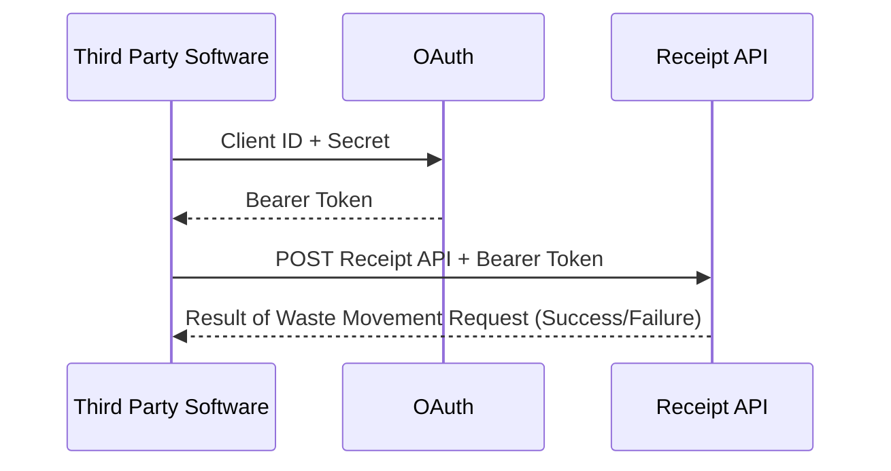

Version 1.0 issued October 2025

# DEFRA Receipt of Waste API Service Guide

## Introduction
This document introduces waste receivers, software developers and third party software users to the DEFRA Waste Tracking Service (DWT) Receipt API. Learn here about the digital processes involved for operators of permitted or licenced waste receiving sites, to report details of each waste movement arriving at their site. This will be mandatory from October 2026.

**Note:** During this document's life-time some of the existing features of the API might be enhanced. You should periodically review the DEFRA Waste Tracking Service (DWT)  Receipt API Service Guide [Changelog](https://github.com/hmrc/ukim-auth-checker-api-service-guide/wiki/UK-Internal-Market-Scheme-(UKIMS)-Authorisation-Checker-API-Service-Guide-Changelog).

## Receipt API Overview 

This API is for waste receivers, software developers and third party software users. It enables operators of permitted or licenced waste receiving sites to report details of each waste movement arriving at their site. This will be mandatory from October 2026. More information about the Digital Waste Tracking is available here:
    <p><a>https://www.gov.uk/government/publications/digital-waste-tracking-service/digital-waste-tracking-service.</a></p>
    
The API is based on REST principles and uses both a <font color="green"><b>POST</b></font> and a <font color="orange"><b>PUT</b></font> method that return data in JSON format. It uses standard HTTP error response codes. </p>
     <p>The API <font color="green"><b>POST</b></font> method is used to create a record for a waste movement that has arrived at a waste receiving site. It returns a waste tracking ID and a validation result. </p> <p>The API <font color="orange"><b>PUT</b></font> method is used to update a waste tracking record using a waste tracking ID to identify the movement. It returns a validation result. Use the API to report/update a waste movement to the Waste Tracking Service.
    
**Note:** At present the API endpoints relate only to Great Britain and Ireland.


### What makes up a Receive Waste Movement?
 The Request Body is an essential part of an API <font color="green"><b>POST</b></font> or <font color="orange"><b>PUT</b></font> request, it containes important data fields that a waste receiver needs to report about a waste movement. 

 The <font color="orange"><b>PUT</b></font> request also contains a mandatory variable called the wasteTrackingId in the URL. 

A breakdown of a typica Receive Waste Movement API Request Body is as follows:


```yaml
{
  "organisationApiId": "ba6eb330-4f7f-11eb-a2fb-67c34e9ac07cg",
  "dateTimeReceived": "UTC - 2025-09-15T12:12:28Z, BST - 2025-09-15T13:12:28+01:00",
  "hazardousWasteConsignmentCode": "Company name: CJTILE Ltd → Code prefix: CJTILE/\nUnique ID: A0001\nFull code: CJTILE/A0001\n",
  "reasonForNoConsignmentCode": "Carrier did not provide documentation",
  "yourUniqueReference": "wTBrdgAA020",
  "otherReferencesForMovement": [
    {
      "label": "PO Number",
      "reference": "PO-12345"
    },
    {
      "label": "Waste Ticket",
      "reference": "WT-67890"
    },
    {
      "label": "Haulier Note",
      "reference": "HN-11111"
    }
  ],
  "specialHandlingRequirements": "The waste must be fully inspected by the waste handler according to the Hazardous waste consignment and or EWC codes provided.",
  "wasteItems": [
    {
      "ewcCodes": "200108 biodegradable kitchen and canteen waste, 150109 textile packaging",
      "wasteDescription": "Basic mixed construction and demolition waste, this includes recyclable house bricks, gypsum plaster and slates.",
      "physicalForm": "Sludge",
      "numberOfContainers": 2,
      "typeOfContainers": "rubble bag, refuse sack, pallet",
      "weight": {
        "metric": "Tonnes",
        "amount": 150,
        "isEstimate": true
      },
      "pops": {
        "containsPops": true,
        "components": [
          {
            "name": "Aldrin, Chlordane, Dieldrin.",
            "concentration": 100
          }
        ]
      },
      "hazardous": {
        "containsHazardous": true,
        "hazCodes": "5 - Wastes from petroleum refining, Natural Gas Purification and pyrolitic treatment of coal, 10 - Wastes from Thermal Processes</p>",
        "components": [
          {
            "name": "lead, mercury",
            "concentration": 50
          }
        ]
      },
      "disposalOrRecoveryCodes": [
        {
          "code": "\"code\": \"R1\"\n",
          "weight": {
            "metric": "Tonnes",
            "amount": 150,
            "isEstimate": true
          }
        }
      ]
    }
  ],
  "carrier": {
    "registrationNumber": "England - CBDL123456, CBDU123456, Scotland - WCR/R/522048, Northern Ireland - ROC UT 36, ROC LT 5432",
    "reasonForNoRegistrationNumber": "Waste carrier did not provide a carrier registration number.",
    "organisationName": "Waste Carriers Lite Ltd",
    "address": {
      "fullAddress": "26a Oil Drum Lane, London, UK",
      "postCode": "W12 7ZL"
    },
    "emailAddress": "info@wastecarrierselite.co.uk",
    "phoneNumber": "020 4756 XXXX",
    "vehicleRegistration": "RNT 493",
    "meansOfTransport": "Rail"
  },
  "brokerOrDealer": {
    "organisationName": "Waste Desposal Ltd",
    "address": {
      "fullAddress": "26a Oil Drum Lane, London, UK",
      "postCode": "W12 7ZL"
    },
    "emailAddress": "info@wastecarrierselite.co.uk",
    "phoneNumber": "020 4756 3232",
    "registrationNumber": "England - CBDL123456, CBDU123456, Wales - CBDL124351, CBDU33435, Scotland - WCR/R/522048, Northern Ireland - ROC UT 36, ROC LT 5432"
  },
  "receiver": {
    "organisationName": "string",
    "emailAddress": "info@wastecarrierselite.co.uk",
    "phoneNumber": "020 4756 XXXX",
    "authorisations": [
      {
        "authorisationNumber": "string",
        "regulatoryPositionStatement": 343
      }
    ]
  },
  "receipt": {
    "address": {
      "fullAddress": "26a Oil Drum Lane, London, UK",
      "postCode": "W12 7ZL"
    }
  }
}
```

In summary, XXXXXX.

## Authentication Process Flow



## API Status

This version of the Receipt of Waste API:

- supports **only** the API v1.0 Receipt of Waste API for Private Beta customers.
- is currently **not** ready for testing
- will **not** be ready for use in general production until the service goes live

## User Journeys
These journeys show practical preparation and use of the API:

- [Developer setup](#developer-setup)
- [Making API Requests](#making-api-requests)
- [Validating a collection of Receipt Requests](#validating-a-collection-of-Receipt-Requests)

## Use the API to:

- Report details of each waste movement arriving at a waste receiver's site.
- Run tests in the sandbox/test environment.

## Developer Setup

To develop using the Receipt of Waste API, you must:

- be familiar with HTTP, RESTful services and JSON (XXXXX OAuth Later Check)
- be registered with a DEFRA account.
- registered as a developer (XXXXX Check Dev account exists)

You can view all the applications you have currently registered on the [Developer Hub] (https://developer.service.defra.gov.uk/api-documentation/docs/api) (XXXXX Check) Applications page, where you can also administer API subscriptions and application credentials. (XXXXX Checks)

## Getting started

### Making API requests

Before sending any requests to the Receipt of Waste API, make sure that you are addressing the following points in your software:

- the correct URL for the environment and API version number
- the correct header contents and payload information

For details, see the [Receipt of Waste API v1.0 Reference Guide](https://github.com/DEFRA/waste-tracking-service/blob/main/docs/apiSpecifications/Receipt%20API.yml).

The base URLs of the sandbox and production environments are as follows:

```code 
Sandbox	https://api.server.test/v1/movements/receive/test

Production https://api.server.test/v1/movements/receive
```
XXXXX

### Validating a collection of Receipt Requests

Link to POST method in the [Receipt of Waste API v1.0 Reference Guide](https://github.com/DEFRA/waste-tracking-service/blob/main/docs/apiSpecifications/Receipt%20API.yml). XXXXX

### Example of a POST request

```curl
curl --location POST 'https://test-api.service.defra.gov.uk/movements/receive
{
[
XXXXX
]
}
```

Example of a successful response:

```code
{
  "xxxxx": "xxxxxx",
  "xxxxx": [
    {
      "": "xxxxx",
      "xxxxx": true
    }
  ]
}
```
### Example of a PUT request

```curl
curl --location POST 'https://test-api.service.defra.gov.uk/movements/{wasteTrackingId}/receive
{
[
XXXXX
]
}
```

Example of a successful response:

```code
{
  "xxxxx": "xxxxxx",
  "xxxxx": [
    {
      "": "xxxxx",
      "xxxxx": true
    }
  ]
}
```
An example of an unsuccessful response, in this case a 401 error. This error response is typically generated when authentication information is not provided, in this example by omitting a bearer token:

POST Request payload:

```code
headers: {
    "Content-Type" : "application/json",
    "Authorisation": `*empty*`
  }
```
Response: 

```code
{
  "code": "MISSING_CREDENTIALS",
  "message": "Authentication information is not provided"
}
```

## Error Responses

A detailed description of the error responses for this API can be found in the [Receipt API v1.0 Reference Guide](https://github.com/DEFRA/waste-tracking-service/blob/main/docs/apiSpecifications/Receipt%20API.yml).
 
## API rate limiting
Each software house should register a single application with HMRC. This application will be used to identify the software house during the OAuth 2.0 grant flow and will also be used in subsequent per user API calls. We limit the number of requests that each application can make. This protects our backend service against excessive load and encourages real-time API calls over batch processing.

We set limits based on anticipated loads and peaks. Our standard limit is 3 requests per second per application. If you believe that your application will sustain traffic load above this value, contact the SDS Team at email [SDSTeam@defra.gov.uk](mailto:SDSTeam@defra.gov.uk XXXXX TBD)

## Changelog

You can find the changelog for this document in the [Receipt API v1.0 Service Guide](https://github.com/DEFRA/waste-tracking-service/wiki/Receipt-of-Waste-API-Changelog) GitHub wiki.
